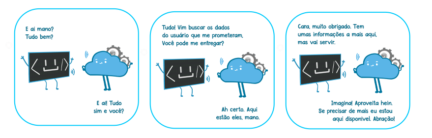

# Novo Modelo Portal da Transparência

Pretende-se apresentar aqui um modelo disruptivo para a construção do novo Portal da Transparência do Estado de Minas Gerais - PdT.
Este modelo é composto pela divisão do PdT em dois sistemas distintos, mas interligados, a saber:

  - Uma API responsável pela disponibilização dos dados; e
  - Uma interface de usuário **open-source** responsável por consumir os dados fornecidos pela API e criar vizualizações inteligentes e interativas.

<figure markdown>
  
Comunicação entre API e interface de usuário

  { align=center }
  <figcaption><a href='https://www.programmers.com.br/blog/niveis-de-maturidade-de-uma-api-rest/'>Níveis de maturidade de uma API REST</a></figcaption>
</figure>

Mais à frente será apresentado algumas das vantagens em se adotar a abordagem open-source para interface do usuário (front-end) do novo Portal. Também serão apresentadas propostas de condução da evolução do projeto após seu lançamento inicial, considerando as contribuições que o código receberá ao longo do tempo.

### Construindo da API para disponibilização dos dados

A primeira etapa do modelo é a construção de uma API[^1], sendo este o sistema que permitirá a comunicação entre a interface do usuário e os dados.
Por ser a PRODEMGE a detentora dos sistemas transacionais, bem como de suas bases de dados, do Estado de Minas Gerais, acredita-se que o modelo ideal para construção desta API seja via contratação da mesma.

### Construindo a interface gráfica em um modelo Open-Source

A segunda etapa do modelo basea-se na construção da interface do usuário (front-end) adotando o modelo open-source.
Algumas das vantagens vislumbradas:

  - Ganhos de escala durante o processo de identificação e correção de erros.
  Ao disponibilizar o código-fonte do projeto para outros entes da federação, mais olhos estarão analisando o código em busca de erros e vulnerabilidades.
  Dessa forma, bugs e falhas de segurança podem ser identificados e reportados de maneira mais ágil.
  **A comunidade também pode contribuir ativamente com correções e soluções alternativas de problemas, o que acelera o processo de resolução dos mesmos e reduzem os custos de desenvolvimento**.
  - **Melhoria contínua do software**, tento em vista a colaboração/revisão constante do código por parte da comunidade.
  A diversidade de perspectivas e experiências pode levar a descobertas inovadoras e à implementação de boas práticas de desenvolvimento.
  - **Flexibilidade**, uma vez que as organizações poderão aproveitar suas funcionalidades básicas, extendendo suas capacidades de acordo com suas necessidades, à exemplo com o que acontece atualmente na utilização do CKAN.

Vale lembrar que **o modelo open-source promoveu transparência, inovação, escalabilidade e desempenhou um papel crucial no sucesso do sistema de gerenciamento de dados CKAN, tornando-o uma referência no gerenciamento de dados abertos em todo o mundo**.
A adoção do código aberto atraiu uma comunidade global de desenvolvedores e colaboradores, que contribuíram e contribuem para aprimorar o sistema, adicionar recursos e garantir sua segurança e estabilidade.
Além disso, sua disponibilidade como uma solução flexível e facilmente adaptável permitiu que as organizações personalizassem o sistema de acordo com suas necessidades, impulsionando sua utilização em diferentes setores e regiões, inclusive no Estado de Minas Gerais.

A inovação aqui proposta vai além da criação de um projeto open-source.
Experiências recentes mostraram que o modelo de contratação e gestão de contratos de software nos moldes atuais são um grande dificultador para o sucesso deste tipo de projeto dentro da adminstração pública estadual.
Neste sentido, propõe-se a criação de um concurso público para selecionar a empresa que entregue um protótipo navegável que mais se adeque às necessidades elencadas para a construção do novo Portal de Transparência.
A equipe/empresa vencedora do concurso será contratada para entregar tanto a versão 1.0 do sistema, quanto para auxiliar na gestão do roadmap de melhorias que será criado a partir das contribuições recebidas pela comunidade criada em torno do novo portal.

### Gestão do roadmap de melhorias

Para garantir o acompanhamento adequado da evolução do projeto e o gerenciamento das contribuições recebidas, é importante estabelecer uma estrutura organizacional clara e eficiente.
Recomenda-se a criação de um time, principal, composto por técnicos da futura empresa contratada em conjunto com técnicos da própria CGE.

Esse time pode ser dividido em diferentes funções, como:

- **Líder de projeto (da CGE):** Responsável pela coordenação geral do projeto, estabelecendo metas, prazos e prioridades, além de gerenciar as priorização das contribuições recebidas.
- **Desenvolvedores principais (da futura empresa contratada):** Responsáveis pela implementação das funcionalidades principais do novo Portal da Transparência, trabalhando em estreita colaboração com a equipe externa de desenvolvedores.
- **Equipe externa de desenvolvedores (da comunidade):** Composta pelos colaboradores da comunidade open-source que desejam contribuir para o projeto. Esses desenvolvedores podem ser atribuídos a tarefas específicas, como correção de bugs, implementação de novos recursos ou revisão do código existente.
- **Revisores de código (da futura empresa contratada):** Encarregados de revisar as contribuições feitas pela comunidade, garantindo a qualidade, consistência e aderência aos padrões de desenvolvimento estabelecidos.
- **Gerente de qualidade (da futura empresa contratada e da CGE):** Responsável por coordenar os testes e garantir que o software seja lançado com a menor quantidade possível de erros e bugs.

### Conclusão do novo modelo

A construção de um novo Portal da Transparência utilizando um modelo open-source traz inúmeras vantagens e economias.
A transparência e o controle oferecidos pelo acesso ao código-fonte, juntamente com as contribuições da comunidade de desenvolvedores, **resultam em um sistema mais robusto, seguro, confiável e econômico**.
Além disso, a possibilidade de escalar o projeto durante a identificação e correção de bugs, bem como a flexibilidade e personalização proporcionadas pelo modelo open-source, são fatores determinantes para o sucesso do empreendimento, **bem como sua utilização em escala nacional**.

[^1]: Modelo amplamente utilizado para construção de sistemas web, inclusive pelo Governo Federal Brasileiro, como pode ser constatado no seu [Catálogo Online de APIS](https://www.gov.br/conecta/catalogo/apis/) e em [reportagens recentes](https://www.convergenciadigital.com.br/Gestao/Governo-lanca-API-do-CadUnico-com-dados-de-94-milhoes-de-pessoas-63459.html) demonstrando a expansão das APIs fornecidas pelo mesmo para bases de dados grandes e importantes como o [CadÚnico](https://www.gov.br/conecta/catalogo/apis/cadunico-servicos).
